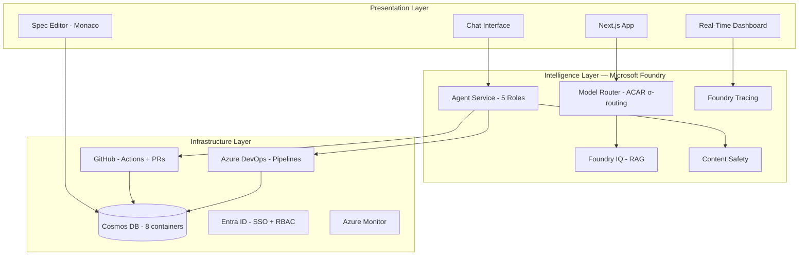

# Blueflame

**The Governed AI Software Refinery**

[]()
[]()
[]()
[]()
[]()

> Turn intent into specs, then execute with authorized, auditable multi-agent DevOps.
> Software should be refined, not generated.

Blueflame is an interactive software refinery that transforms human intent into explicit, versioned specifications and executes them through a governed swarm of AI agents. Authorization gates, immutable plan locks, budget ceilings, CI/CD failure intelligence, and real-time observability keep humans in control while accelerating delivery through agentic DevOps.

**Grounded in original research:** [ACAR (Adaptive Complexity & Attribution Routing)](https://zenodo.org/records/18446175), validated across 7,550+ auditable runs on four benchmarks.

---

## The Problem

| Pain Point | Impact |
|---|---|
| AI tools generate code without understanding intent | Requirements drift silently; architectural decisions erode |
| No authorization gate before AI acts | Developers either micromanage AI or lose control entirely |
| CI/CD failures require manual investigation | Hours wasted on root cause analysis that could be automated |
| No audit trail for AI-generated work | Enterprise compliance impossible; trust deficit persists |
| Budget-blind AI execution | Runaway costs with no graceful degradation |

## The Solution

Blueflame enforces a 6-stage refinement loop where every workflow follows the same governed path:

```
Chat / Upload / Codebase  →  Output Spec  →  Plan + Authorize  →  Agent Swarm  →  PRs  →  Review
         (Intent)              (Truth)         (Gate)              (Execution)    (Code)   (Human)
```

Every stage is a hard gate. No agent executes without an authorized, immutable `plan.lock.json`. No code merges without human review. Every action is traced, costed, and auditable.

---

## Architecture



### Three-Layer Stack

| Layer | Services | Purpose |
|---|---|---|
| **Presentation** | Next.js, React, Tailwind, Monaco Editor, Socket.IO | Chat, spec editing, real-time dashboard, budget controls |
| **Intelligence** | Microsoft Foundry (11 services), ACAR σ-routing | Agent orchestration, model selection, RAG, safety, tracing |
| **Infrastructure** | Azure (13 services), GitHub, Azure DevOps | Data persistence, CI/CD, auth, observability, governance |

---

## Key Features

### Spec-First SDLC
Human intent is crystallized into a versioned, SHA-256-hashed Output Spec before any agent executes. The spec is the source of truth — not the AI.

### Governed Multi-Agent Swarm
Five specialized agent roles (Planner, Builder, Verifier, Explainer, Fixer) operate under strict authorization. Each agent has scoped permissions, bounded budgets, and full traceability.

### Authorization Gates
No agent spawns without an immutable `plan.lock.json` signed by an authorized user (RBAC-gated). The lock captures: frozen spec hash, task DAG, budget ceiling, constraint snapshot, and agent permissions.

### ACAR-Informed Multi-Provider Routing
Self-consistency variance (σ) from N=3 samples routes tasks across execution modes and providers. Simple tasks (σ=0) use single-model (e.g., GPT-4o-mini). Complex tasks (σ=1.0) use multi-model ensemble across providers (Azure OpenAI + Anthropic + Google). 54% of tasks avoid full ensembling — up to 70% cost reduction. Each agent role has configurable provider+model defaults.

### CI/CD Failure Intelligence
Azure DevOps pipeline failures are captured, normalized, and analyzed by the Fixer agent. Root cause analysis and remediation plans flow through the same authorization gate. No unreviewed fixes.

### Budget Governance
Users set cost ceilings. The system warns at 80%, pauses at 95%, and handles partial execution gracefully. Completed work is preserved as PRs. In-progress work becomes draft PRs.

### Spec Delta Detection
When specs change mid-execution, the system computes semantic diffs, maps impact to tasks (preserve/rebuild/new/remove), and surgically re-executes only what's affected.

### SCR Governance (Spec-Freeze Doctrine)
A frozen spec is law. Changing it is a governance event — not a chat edit. Spec Change Requests (SCRs) enforce a formal workflow: create change request with reason → automatic DiffPack + impact analysis → approve/reject by Authorizer → delta execution that patches the existing plan and only re-executes affected tasks. Completed work is preserved. Every SCR is audited with full traceability back to DiffPack items.

### Constraint Registry
Persistent, project-level rules (architectural, security, performance) survive across runs. The Verifier evaluates agent outputs against these constraints — not just model agreement.

---

## Agent Roles

| Role | Responsibility | Default Model (Configurable) | Key Insight |
|---|---|---|---|
| **Planner** | Task decomposition, DAG construction, σ-based effort estimation | o1 (Azure) — fallback: Claude Opus 4.6 | ACAR task difficulty estimation |
| **Builder** | Code implementation, branch management, PR creation | Claude Sonnet 4.5 (Anthropic) — fallback: Codex / GPT-4o | σ-routing: single/lite/full based on task complexity |
| **Verifier** | Test execution, constraint validation, acceptance checking | GPT-4o (Azure) — fallback: Gemini 2.5 Pro | Uses acceptance criteria as ground truth — not model consensus (ACAR: agreement-but-wrong is unrecoverable) |
| **Explainer** | Root cause analysis, PR descriptions, decision rationale | GPT-4o (Azure) — fallback: Claude Opus 4.6 | Uses explicit diffs — not proxy estimation (ACAR: proxy attribution fails) |
| **Fixer** | CI/CD failure analysis, remediation planning | GPT-4o + Claude Sonnet 4.5 (multi-provider) | Reads pipeline logs + test results, produces governed remediation DAG |

---

## Supported Workflows

| # | Workflow | Entry Point | Key Moment |
|---|---|---|---|
| 1 | **Greenfield Feature Build** | Chat | Full 6-stage lifecycle: intent → spec → plan → authorize → execute → PR |
| 2 | **PRD to Swarm Build** | Document Upload | Upload PRD → auto-extract spec → requirement-to-code traceability |
| 3 | **Refactor Under Constraints** | Codebase Context | Constraint registry enforced throughout refactoring |
| 4 | **Bug Fix + Root Cause** | Chat + Codebase | Explainer produces ACAR-informed attribution with explicit diffs |
| 5 | **Budget-Constrained Partial** | Any | Graceful pause at ceiling, partial PRs preserved |
| 6 | **Spec Change Request (SCR)** | Spec Editor | Frozen spec change → SCR governance → DiffPack + impact analysis → delta execution (patch plan, re-execute only affected tasks) |
| 7 | **CI/CD Failure Intelligence** | ADO Service Hook | Pipeline failure → governed remediation → validated re-run |

---

## Technology Stack

| Layer | Technology | Purpose |
|---|---|---|
| Frontend | Next.js 14 + React + Tailwind CSS | Chat, spec editor, dashboard |
| Real-Time | Socket.IO (Azure Web PubSub adapter for prod) | Live agent streaming, budget alerts |
| Backend | Node.js + TypeScript on Azure Container Apps | API gateway, webhooks, orchestration |
| AI Platform | Microsoft Foundry (11 services) | Agent factory: models, routing, workflows, safety, tracing |
| Models | GPT-4o, o1, GPT-4o-mini (Azure) + Claude Opus 4.6, Sonnet 4.5 (Anthropic) + Gemini 2.5 Pro/Flash (Google) + Codex (OpenAI) | σ-informed multi-provider selection via Foundry Model Router |
| Agent Framework | Microsoft Agent Framework + A2A + MCP | Multi-agent orchestration and tool access |
| Database | Azure Cosmos DB (8 containers) | Specs, plans, locks, runs, agents, constraints, documents, failures |
| CI/CD | GitHub Actions + Azure DevOps Pipelines | Agentic DevOps + failure intelligence |
| Auth | Azure Entra ID | SSO, 4-tier RBAC, scoped agent identities |
| Safety | Foundry Content Safety + Protected Material Detection | PII, licensed code, prompt injection prevention |
| Governance | Azure Policy + Foundry Control Plane | Rules, model allowlists, budget enforcement |
| Observability | Azure Monitor + Foundry Tracing | Full audit trail, cost tracking |
| IaC | Azure Bicep | Repeatable infrastructure deployment |
| Monorepo | Turborepo + npm workspaces | Build orchestration |
| Linting | Biome | Fast lint + format |
| Testing | Vitest (unit) + Playwright (E2E) | 540+ tests |

---

## Enterprise Upgrade Paths

Every component is designed with a clear migration from local-first MVP to enterprise-scale deployment. No dead ends.

| Component | MVP (Current) | Enterprise Path | Azure Service |
|---|---|---|---|
| Run state | In-memory Map | Cosmos DB partitioned by org | Azure Cosmos DB |
| Failure store | In-memory Map | Cosmos DB with TTL + org partition | Azure Cosmos DB |
| Budget tracking | Per-run ceiling | Org-level pools, team allocation, chargeback | Azure Cost Management |
| Agent orchestration | Single-server DAG | KEDA auto-scaling per org | Azure Container Apps |
| Real-time streaming | Single Socket.IO hub | Room-per-org isolation | Azure Web PubSub |
| ADO adapter | Direct REST calls | Service Bus queue for webhook ingestion | Azure Service Bus |
| Authentication | Single-tenant Entra ID | Multi-tenant with B2B collaboration | Azure Entra ID |
| Observability | Single Monitor workspace | Per-org workspaces with aggregation | Azure Monitor |
| Constraint enforcement | In-process checks | Azure Policy-backed org-level inheritance | Azure Policy |

---

## Project Structure

```
blueflame/
├── apps/
│   ├── api/                # Backend API (Azure Container Apps)
│   │   ├── src/
│   │   │   ├── middleware/  # Auth, RBAC, error handling
│   │   │   ├── routes/      # REST endpoints
│   │   │   ├── services/    # Business logic (orchestrator, budget, auth)
│   │   │   ├── signalr/     # Socket.IO real-time hub
│   │   │   └── webhooks/    # GitHub + ADO webhook handlers
│   │   └── vitest.config.ts
│   └── web/                # Frontend (Next.js on Azure Static Web Apps)
│       ├── app/            # App Router pages
│       ├── components/     # React components (chat, spec, plan, dashboard, budget)
│       ├── hooks/          # Custom hooks (useSignalR, useRole)
│       └── lib/            # Client configs (MSAL, SignalR)
├── packages/
│   ├── shared/             # Domain types, Zod schemas, utilities
│   ├── cosmos/             # Azure Cosmos DB wrapper + repositories
│   ├── foundry/            # Microsoft Foundry agent wrappers
│   └── github-app/         # GitHub App client (Octokit)
├── infra/                  # Azure Bicep IaC templates
├── docs/                   # Architecture docs, QA reports, status
└── turbo.json              # Turborepo build configuration
```

---

## Quick Start

### Prerequisites

- Node.js 20+
- npm 10+
- Azure CLI (`az`) with Bicep extension
- GitHub App credentials
- Azure Cosmos DB (or emulator)
- Microsoft Foundry API access

### Setup

```bash
# Clone
git clone https://github.com/anthropics/blueflame.git
cd blueflame

# Install dependencies
npm install

# Configure environment
cp .env.example .env
# Edit .env with your Azure, Foundry, GitHub, and Entra ID credentials

# Build all packages
npx turbo build

# Run tests
npx turbo test

# Start development
npx turbo dev
```

### Commands

| Action | Command |
|---|---|
| Install | `npm install` |
| Build all | `npx turbo build` |
| Test all | `npx turbo test` |
| Dev (all) | `npx turbo dev` |
| Lint | `npx biome check .` |
| Lint fix | `npx biome check --fix .` |
| Typecheck | `npx turbo typecheck` |
| Deploy infra | `az deployment group create -f infra/main.bicep` |

---

## Testing

```
Total: 540+ tests across 7 packages
├── apps/api:      234 tests (services, routes, middleware, webhooks, SignalR, SCR)
├── apps/web:      128 tests (components, hooks, dashboard, animations, budget, SCR panel)
├── packages/foundry: 150 tests (6 agents, prompts, parsers, σ-routing)
├── packages/cosmos:  44 tests (repositories, change feed)
├── packages/github-app: 24 tests (branches, PRs, actions, diffs)
└── packages/shared:   28 tests (hash, types, schemas)
```

All tests run in CI via GitHub Actions on every PR.

---

## Security & Governance

| Layer | Mechanism |
|---|---|
| **Authentication** | Azure Entra ID SSO with MSAL |
| **Authorization** | 4-tier RBAC: Viewer < Editor < Authorizer < Admin |
| **Agent Permissions** | Scoped Entra Agent IDs — branch-write + PR-create only |
| **Immutable Locks** | `plan.lock.json` — SHA-256 spec hash, frozen budget, constraint snapshot |
| **Code Safety** | Foundry Protected Material Detection — prevents licensed code generation |
| **PII Protection** | Foundry Content Safety — filters PII from prompts and generated code |
| **Prompt Hygiene** | Foundry Control Plane — injection detection, tool call authorization |
| **Webhook Security** | HMAC-SHA256 signature verification on all webhooks |
| **Branch Protection** | Agents cannot merge — human approval required |
| **Audit Trail** | Every agent action traced via OpenTelemetry → Azure Monitor |

---

## Roadmap

| Phase | Status | Description |
|---|---|---|
| **S1-S3: Foundation** | Done | Monorepo, Bicep, CI, SignalR, types, auth, RBAC, Cosmos DB |
| **S4-S5: Core Loop** | Done | Chat UI, designer agent, spec editor, spec generation, freeze |
| **S6: Planning** | Done | Planner agent, DAG visualization, authorization gate |
| **S7-S8: Agent Swarm** | Done | Builder, verifier, explainer, orchestrator, GitHub integration |
| **S9-S10: Governance** | Done | Budget system, dashboard, agent cards, animations |
| **S11: Failure Intelligence** | Done | ADO adapter, Fixer agent, remediation gate, failure dashboard |
| **S12: ACAR σ-Routing** | Done | σ-based model selection, self-consistency sampling, cost benchmarking |
| **S13: Enterprise Governance** | Done | OpenTelemetry tracing, compliance dashboard, reasoning trace viewer |
| **S14: Spec Delta Detection** | Done | WF6: spec diff engine, impact classifier, surgical re-execution |
| **S15: CI/CD Templates** | Done | Cosmos failures, verifier templates, security constraints, ADO outbound |
| **S16: Enterprise Budgeting** | Done | Budget pools, chargeback dashboard (SignalR + AppInsights deferred) |
| **SCR Governance + Delta Execution** | Done | Spec-Freeze Doctrine, SCR workflow, DiffPack, TaskPatch, Patch Mode agents |
| **E2E Integration** | Done | 12-phase gap resolution, all 13 integration gaps fixed |
| **Demo + Submit** | In Progress | Recording, submission package |

---

## Hackathon

**Microsoft AI Dev Days** (February 10 – March 15, 2026)

### Target Categories

| Category | Blueflame Strength |
|---|---|
| **Grand Prize** | Production-grade AI application with research-validated routing (ACAR) |
| **Best Multi-Agent System** | 5 specialized roles with A2A, MCP, σ-routing, governed execution |
| **Best Enterprise Solution** | Authorization gates, RBAC, budget governance, audit trail, CI/CD failure intelligence, enterprise upgrade paths |
| **Best Use of Microsoft Foundry** | 11 Foundry services — deepest integration in the hackathon |

### Research Foundation

Blueflame is backed by [ACAR (Adaptive Complexity & Attribution Routing)](https://zenodo.org/records/18446175), a peer-quality research paper with:
- 7,550+ auditable runs across 4 benchmarks and 1,510 tasks
- Falsifiable baselines and documented negative results
- σ-based routing that avoids full ensembling on 54% of tasks
- Key finding: agreement-but-wrong is unrecoverable — Blueflame's Verifier uses spec-defined criteria, not model consensus

---

## Team

Solo entrant.

## License

See [LICENSE](LICENSE).

---

*Blueflame: Refine, don't generate.*
